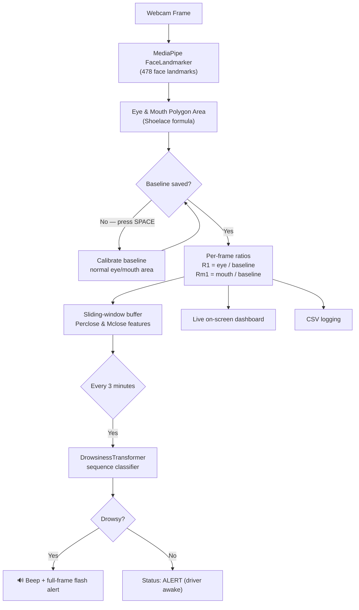
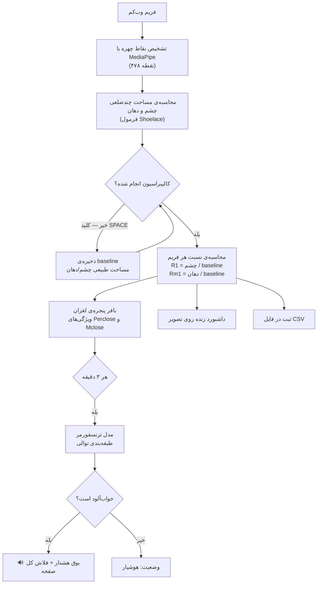

# Driver Drowsiness Detection Demo

A real-time driver drowsiness monitor that uses a webcam, MediaPipe face landmarks, and a
Transformer neural network to detect signs of fatigue (prolonged eye closure and yawning)
and raise an alert before it becomes dangerous.
---

## 📊 Pipeline Overview



**Stages, step by step:**

1. **Capture** – OpenCV grabs frames from the webcam.
2. **Landmark detection** – MediaPipe's `FaceLandmarker` (new Tasks API) locates 478 facial
   landmarks per frame, including iris points.
3. **Geometric features** – The polygon area of the eyes and mouth is computed from selected
   landmark contours using the Shoelace formula.
4. **Calibration (baseline)** – Pressing `SPACE` the first time records the user's *normal*
   (eyes-open, mouth-closed) eye and mouth area as a personal reference.
5. **Per-frame ratios** – Every subsequent frame computes:
   - `R1` = current eye area / baseline eye area → drops when eyes close.
   - `Rm1` = current mouth area / baseline mouth area → rises when yawning.
6. **Sliding-window aggregation** – A rolling window over recent frames computes:
   - `Perclose` – fraction of frames with eyes closed (`R1` below threshold).
   - `Mclose` – fraction of frames with mouth open (`Rm1` above threshold).
7. **Transformer inference** – Every 3 minutes, the sequence of `(Perclose, Mclose)` windows
   is fed into a trained Transformer classifier (`final_best_model_fold_5.pth`) which predicts
   **ALERT** or **DROWSY**, with a confidence score.
8. **Alerting** – A drowsy prediction triggers a cross-platform beep and a red full-frame flash
   overlay.
9. **Dashboard & logging** – A live on-screen panel shows current ratios, alert counts, and
   inference status; all per-frame metrics are logged to a timestamped CSV file.

---

## ▶️ How the Demo Works

1. Run the script — it opens your default webcam.
2. Sit normally, facing the camera, with your eyes open and mouth closed.
3. Press **SPACE**: this saves your personal baseline (a reference photo + `.txt` file) and
   starts a 3-second countdown before monitoring begins.
4. Once monitoring starts, the dashboard updates in real time with:
   - `R1` (eye openness ratio) and `Rm1` (mouth openness ratio)
   - `Perclose` / `Mclose` rolling statistics
   - Frame counters and alert percentages
   - Time remaining until the next Transformer inference report (every 3 minutes)
5. If the model predicts **DROWSY**, you'll hear a beep and see a full-screen warning flash.
6. Press **ESC** at any time to stop monitoring; a summary is appended to the CSV log and the
   window closes.

---

## 📦 Requirements

- Python 3.10+ (tested on 3.13)
- A webcam
- Packages listed in [`requirements.txt`](./requirements.txt):
  - `opencv-python`
  - `mediapipe` (≥ 0.10.30 — uses the new Tasks API, `FaceLandmarker`)
  - `numpy`
  - `pandas`
  - `torch`
- The trained model weights file `final_best_model_fold_5.pth` (place it in the same folder
  as the script)
- The MediaPipe face landmark model `face_landmarker.task` — **downloaded automatically**
  on first run if not already present (requires an internet connection the first time only)

---

## 🚀 Installation & Usage

```bash
# 1. Clone the repository
git clone https://github.com/<your-username>/<your-repo>.git
cd <your-repo>

# 2. Create and activate a virtual environment (recommended)
python -m venv venv
venv\Scripts\activate        # Windows
# source venv/bin/activate   # macOS / Linux

# 3. Install dependencies
pip install -r requirements.txt

# 4. Make sure final_best_model_fold_5.pth is in the project folder

# 5. Run the demo
python Drowsiness_Detection_DEMO.py
```

Controls while running:
| Key     | Action                                  |
|---------|------------------------------------------|
| `SPACE` | Save baseline / start monitoring          |
| `ESC`   | Stop monitoring and exit                  |

---


---

# سیستم تشخیص خواب‌آلودگی راننده (نسخه‌ی دمو)

یک برنامه‌ی نظارت بلادرنگ (real-time) بر خواب‌آلودگی راننده که با استفاده از وب‌کم، نقاط
کلیدی چهره (landmarks) از MediaPipe، و یک شبکه‌ی عصبی ترنسفورمر، نشانه‌های خستگی (بسته‌شدن
طولانی‌مدت چشم و خمیازه) را تشخیص می‌ده و قبل از خطرناک شدن وضعیت، هشدار می‌ده.


---

## 📊 نمای کلی پایپلاین



**مراحل، گام‌به‌گام:**

۱. **دریافت تصویر** – OpenCV فریم‌ها رو از وب‌کم می‌گیره.

۲. **تشخیص نقاط چهره** – ماژول `FaceLandmarker` از MediaPipe (نسخه‌ی جدید Tasks API) در هر
فریم ۴۷۸ نقطه‌ی کلیدی چهره (شامل نقاط عنبیه‌ی چشم) رو پیدا می‌کنه.

۳. **ویژگی‌های هندسی** – مساحت چندضلعی چشم‌ها و دهان با استفاده از فرمول Shoelace و بر
اساس مجموعه‌ای از نقاط کانتور محاسبه می‌شه.

۴. **کالیبراسیون (baseline)** – با زدن کلید `SPACE` برای اولین بار، وضعیت طبیعی کاربر
(چشم باز، دهان بسته) به‌عنوان مرجع شخصی ذخیره می‌شه.

۵. **نسبت هر فریم** – در هر فریم بعدی این دو مقدار محاسبه می‌شه:
   - `R1` = مساحت فعلی چشم ÷ مساحت مرجع چشم → با بسته‌شدن چشم کاهش پیدا می‌کنه.
   - `Rm1` = مساحت فعلی دهان ÷ مساحت مرجع دهان → با خمیازه کشیدن افزایش پیدا می‌کنه.

۶. **تجمیع در پنجره‌ی لغزان** – یک پنجره‌ی متحرک روی فریم‌های اخیر این دو مقدار رو محاسبه
می‌کنه:
   - `Perclose` – درصد فریم‌هایی که چشم بسته بوده (`R1` زیر آستانه).
   - `Mclose` – درصد فریم‌هایی که دهان باز بوده (`Rm1` بالای آستانه).

۷. **استنتاج مدل ترنسفورمر** – هر ۳ دقیقه، توالی مقادیر `(Perclose, Mclose)` به یک مدل
ترنسفورمر آموزش‌دیده (`final_best_model_fold_5.pth`) داده می‌شه که وضعیت **هوشیار** یا
**خواب‌آلود** رو همراه با درصد اطمینان پیش‌بینی می‌کنه.

۸. **هشداردهی** – در صورت پیش‌بینی خواب‌آلودگی، یک بوق (در همه‌ی سیستم‌عامل‌ها) و یک فلاش
قرمز روی کل تصویر نمایش داده می‌شه.

۹. **داشبورد و ثبت داده** – یک پنل زنده روی تصویر، نسبت‌های فعلی، تعداد هشدارها و وضعیت
استنتاج رو نشون می‌ده؛ همه‌ی مقادیر هر فریم هم در یک فایل CSV با برچسب زمانی ثبت می‌شه.

---

## ▶️ نحوه‌ی کار این دمو

۱. اسکریپت رو اجرا کن — وب‌کم پیش‌فرض سیستم باز می‌شه.

۲. به‌صورت عادی، رو به دوربین بشین، با چشم‌های باز و دهان بسته.

۳. کلید **SPACE** رو بزن: این کار baseline شخصی‌ات رو ذخیره می‌کنه (یک عکس مرجع + یک فایل
متنی) و یک شمارش معکوس ۳ ثانیه‌ای قبل از شروع نظارت اجرا می‌شه.

۴. وقتی نظارت شروع شد، داشبورد به‌صورت زنده این موارد رو نشون می‌ده:
   - `R1` (نسبت بازبودن چشم) و `Rm1` (نسبت بازبودن دهان)
   - آمار لحظه‌ای `Perclose` / `Mclose`
   - شمارنده‌ی فریم‌ها و درصد هشدارها
   - زمان باقی‌مانده تا گزارش بعدی مدل ترنسفورمر (هر ۳ دقیقه)

۵. اگه مدل تشخیص بده که راننده **خواب‌آلود** است، یک بوق پخش می‌شه و یک هشدار تمام‌صفحه
نمایش داده می‌شه.

۶. در هر لحظه با زدن کلید **ESC** می‌تونی نظارت رو متوقف کنی؛ یک خلاصه به فایل CSV اضافه
می‌شه و پنجره بسته می‌شه.

---

## 📦 نیازمندی‌ها

- پایتون ۳.۱۰ به بالا (روی نسخه‌ی ۳.۱۳ تست شده)
- یک وب‌کم
- پکیج‌های ذکرشده در [`requirements.txt`](./requirements.txt):
  - `opencv-python`
  - `mediapipe` (نسخه‌ی ۰.۱۰.۳۰ به بالا — از API جدید Tasks یعنی `FaceLandmarker` استفاده می‌کنه)
  - `numpy`
  - `pandas`
  - `torch`
- فایل وزن‌های مدل آموزش‌دیده `final_best_model_fold_5.pth` (باید کنار اسکریپت باشه)
- مدل تشخیص نقاط چهره‌ی MediaPipe یعنی `face_landmarker.task` — در اولین اجرا **به‌صورت
  خودکار دانلود می‌شه** (فقط دفعه‌ی اول به اینترنت نیاز داره)

---

## 🚀 نصب و اجرا

```bash
# ۱. کلون کردن مخزن
git clone https://github.com/<your-username>/<your-repo>.git
cd <your-repo>

# ۲. ساخت و فعال‌سازی محیط مجازی (پیشنهادی)
python -m venv venv
venv\Scripts\activate        # ویندوز
# source venv/bin/activate   # مک / لینوکس

# ۳. نصب پکیج‌های مورد نیاز
pip install -r requirements.txt

# ۴. مطمئن شو فایل final_best_model_fold_5.pth کنار پروژه است

# ۵. اجرای برنامه
python Drowsiness_Detection_DEMO.py
```

کلیدهای میانبر هنگام اجرا:

| کلید    | عملکرد                                   |
|---------|-------------------------------------------|
| `SPACE` | ذخیره‌ی baseline / شروع نظارت              |
| `ESC`   | توقف نظارت و خروج از برنامه                |


---

